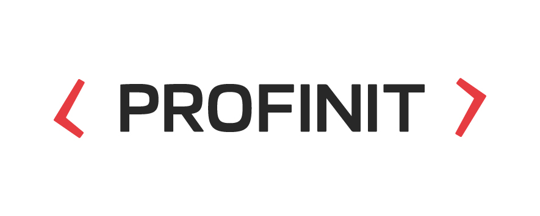

# OpenDataLab 👋  

### Baví tě práce s otevřenými daty?

OpenDataLab je otevřená laboratoř založená ve spolupráci s ČVUT FIT.
Nabízíme témata závěrečných prací a k jejich vypracování ti poskytneme vedení
a know-how zkušených expertů z oblasti big data a machine learning. V naší laboratoři potkáš lidi se zkušenostmi z velkých projektů, kteří si umí dobře poradit s analýzou velkého množství dat a rádi tyto zkušenosti předají i tobě. Tvá práce bude navíc sloužit dobrému účelu a bude z ní mít prospěch široká veřejnost.

Laboratoř vznikla v říjnu 2018.

#### https://opendatalab.cz

## Naše práce:
#### * 💸 Transparentní účty https://transparentniucty.opendatalab.cz
#### * 🏥 Mapa zdraví https://lekarivcr.opendatalab.cz
#### * 👨🏻‍⚖️ ISIR Explorer https://isir-explorer.opendatalab.cz/
#### * 🚘 STK portál https://stk-test.opendatalab.cz/
#### * 💉 COVID-19 očkování https://ockovani.opendatalab.cz/
#### * 🌐 Ostatní https://opendatalab.cz/projekty/

Staňte se součástí naší inovativní komunity! Spolupracujte s námi na zajímavých zadáních nebo představte svůj vlastní nápad!

Pokud chcete zobrazit naše aktuální zadání, navštivte stránku: https://opendatalab.cz/zadani/

## Kontakt:
🏠 International Business Center
Pobřežní 620/3, Praha 8  
✉️ info@opendatalab.cz

  
  &emsp;
   
  &emsp;
   

